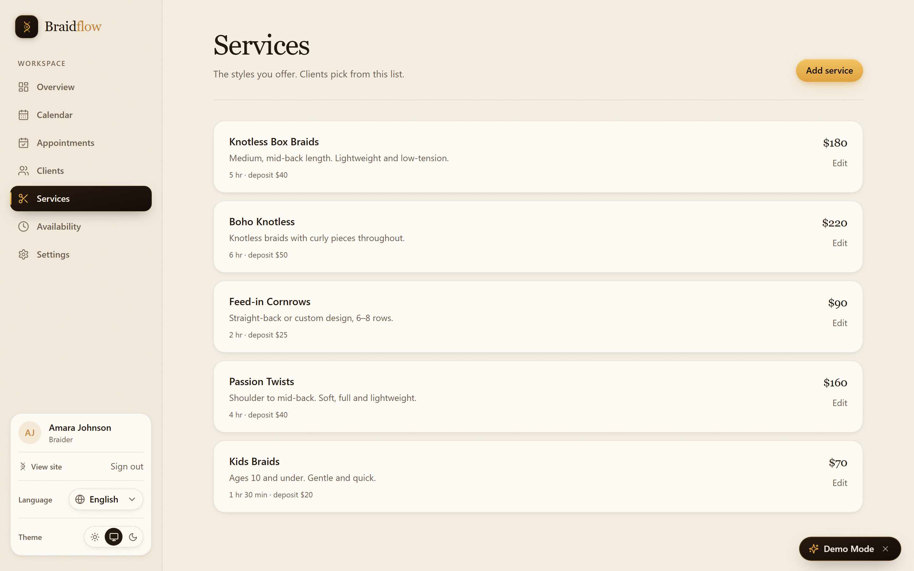
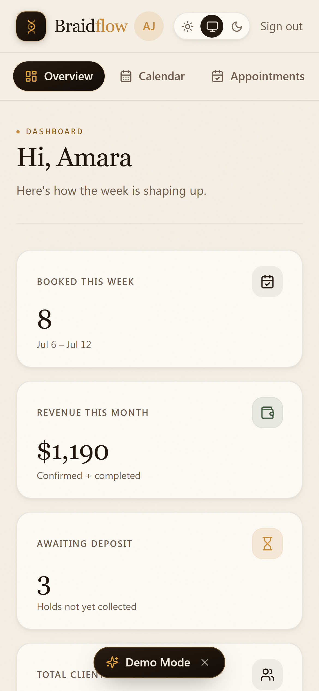
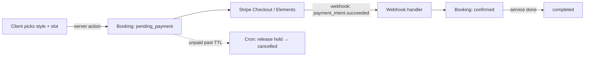

<div align="center">

# BraidFlow

### Quit the DMs. Get paid up front.

A booking-and-deposit platform built specifically for hair braiders — a shareable
booking page that collects a deposit through Stripe, locks the slot, and runs the
whole week from one dashboard.

[](https://github.com/elkamohammad1988/braidflow-saas/actions/workflows/ci.yml)
&nbsp;


**[▶ Live demo](https://braidflow.vercel.app)** · [Case study](marketing/portfolio-case-study.md) · [Screenshots](#screenshots) · [Architecture](#architecture)

<br/>


</div>

---

## Why BraidFlow

Braiders run a real business out of their DMs. A single client is four to eight hours
in the chair, so one no-show doesn't cost a slot — it costs a day. And the tools that
exist (Square, Acuity, Calendly) were built for thirty-minute haircuts, with deposits
bolted on as an afterthought.

BraidFlow flips that. A braider sets up a booking page in about fifteen minutes.
Clients pick a style, pick a time, and pay a deposit through Stripe **before** the slot
is held. The balance is paid in person. No back-and-forth, no ghosting a full day, no
chasing money after the fact.

|  |  |
|---|---|
| **100%** of every deposit stays with the braider | **0%** commission on services |
| **~15 min** to set up a booking page | **~90 sec** for a client to book |

> **Try it now → [braidflow.vercel.app](https://braidflow.vercel.app)**
> No signup required. To land inside the braider dashboard, sign in with
> **`amara@braidflow.app`** and any password. Every screen runs on realistic sample
> data — a floating *Demo Mode* badge explains it.

---

## Features

### For the braider
- **A booking page that pays you first.** Clients pay a deposit through Stripe before a
  slot is confirmed. No deposit, no hold.
- **One dashboard for the week.** Overview KPIs — booked this week, revenue this month,
  deposits still owed, total clients — then a weekly calendar and a full appointments list.
- **Services with real detail.** Name, description, price, duration, and a *per-service*
  deposit amount. Clients pick from this list.
- **Availability that fits a life.** Weekly hours plus one-tap date overrides for
  vacations and kids' events. All scheduling is **timezone-correct** — counts and revenue
  land in the braider's own zone, not the server's.
- **Clients, remembered.** Every person who's booked rolls up with visit count, lifetime
  value, and last-seen date — registered clients and guests alike.
- **Stripe Connect payouts.** Deposits pay out straight to the braider's account, and
  refunds reverse the transfer. A guided activation checklist walks first-timers through
  service → hours → Stripe.

### For the client
- **Book in about ninety seconds.** Pick a style, pick a slot, pay the deposit.
- **Guest checkout.** No account required to book; the booking is managed from a secure link.
- **A real marketplace.** Search a directory of braiders with ratings, open a public
  profile with reviews, reschedule (the deposit carries over) or cancel from a link.

### Under the hood
- **Deposit-driven booking state machine:** `pending_payment → confirmed → completed / cancelled`,
  with Stripe **webhooks** as the source of truth.
- **Vercel Cron** sends 24h/2h reminders and automatically releases holds that were never paid.
- Transactional email through **Resend**, error monitoring through **Sentry**, security
  headers, rate limiting, and audit logging — each an optional integration that no-ops
  cleanly without keys.

---

## Screenshots

<div align="center">

|  |  |
|:--:|:--:|
|  |  |
| **Dashboard** — the week at a glance | **Calendar** — every slot, confirmed or awaiting deposit |
|  |  |
| **Appointments** — past and upcoming, with status and totals | **Services** — price, duration, and a deposit per style |
|  |  |
| **Directory** — a searchable marketplace with ratings | **Mobile** — the full workspace in a pocket |

</div>

More in [`marketing/screenshots`](marketing/screenshots).

---

## Architecture

BraidFlow is a **Next.js 14 App Router** application. Reads are server components;
every mutation is a **server action** validated with **Zod**. Route protection runs on
the **Edge** from a signed session cookie — no backend round-trip to know who you are.



**The data layer is deliberately swappable.** In this demo it's an in-memory store
behind a PostgREST-style query builder with a deterministic seed, reached through a
single `db()` / `dbAdmin()` interface. Because feature code only ever talks to that
interface, the store can be replaced with a real Postgres/Supabase backend without
touching a single page or action. That's what lets the whole app **build and deploy
with zero configuration** — no database, no auth provider, nothing to wire up.

Every row is **fully typed** end to end: the schema lives in `types/db.ts`, and the
query builder is generic over it, so `db().from('bookings').select(…)` returns typed
rows (no `any`). The production Postgres schema that store emulates — tables, enums,
foreign keys, indexes, **Row-Level Security**, and the `EXCLUDE USING gist` overlap
constraint the booking code's `23P01` handler expects — ships in
[`supabase/migrations`](supabase/migrations). Apply it and point `db()`/`dbAdmin()` at
a real client to go production-backed with no feature-code changes.

- **Auth** — a signed httpOnly cookie (Web Crypto **HMAC-SHA256**). The exact same
  verification runs in Edge middleware and in Node server actions, so there's one code
  path for "who is this request."
- **Payments** — Stripe Connect for payouts, Elements for checkout, and a webhook that
  is the single source of truth for confirming a booking.
- **Time** — `date-fns` + `@date-fns/tz` so "this week" and "revenue this month" are
  computed in the braider's timezone.
- **Jobs** — Vercel Cron endpoints for reminders and hold expiry.

---

## Tech stack

| Layer | Choices |
|---|---|
| **Framework** | Next.js 14 (App Router, RSC, Server Actions), React 18 |
| **Language** | TypeScript (strict) |
| **Styling** | Tailwind CSS + a custom design system |
| **Payments** | Stripe — Connect, Elements, webhooks |
| **Email** | Resend (transactional) |
| **Validation** | Zod |
| **Dates / timezones** | date-fns, @date-fns/tz |
| **Monitoring** | Sentry (`@sentry/nextjs`) |
| **Testing** | Vitest |
| **Runtime** | Edge Middleware, Vercel Cron |
| **Hosting** | Vercel |

---

## Project structure

```
braidflow/
├── app/
│   ├── (marketing)/        # public landing, pricing, legal
│   ├── (auth)/             # login, signup, password reset
│   ├── (braider)/dashboard # overview, calendar, appointments, clients,
│   │                       #   services, availability, settings
│   ├── (client)/           # braider directory, profiles, booking, my bookings
│   ├── api/                # stripe webhook, cron (reminders, expire holds)
│   └── layout.tsx · sitemap.ts · robots.ts · opengraph-image.tsx · manifest.ts
├── components/
│   ├── ui/                 # design-system primitives (button, card, input…)
│   ├── booking/ · braider/ · review/    # feature components
│   ├── marketing/ · motion/ · demo/     # landing visuals + reveal/motion
│   └── shared/             # navbar, footer, page header, empty state
├── lib/
│   ├── db/                 # in-memory store + query builder + deterministic seed
│   ├── auth/               # signed-cookie sessions, personas, server actions
│   ├── bookings/ · availability/ · services/ · reviews/   # domain logic
│   ├── braider/ · payments/ · stripe/   # Connect, checkout, payouts
│   ├── crypto/             # shared edge-safe HMAC signing (domain-separated)
│   ├── email/ · cron/ · audit/ · monitoring.ts
│   └── timezones.ts · format-date.ts · env.ts · utils.ts
├── types/db.ts             # database schema types (source of truth for rows)
├── supabase/migrations/    # production Postgres schema + RLS (0001, 0002)
├── marketing/              # screenshots, demo package, case study, listings
├── Dockerfile · .dockerignore     # containerized standalone build
├── app/api/health/         # liveness/readiness probe
└── middleware.ts · next.config.mjs · vercel.json · tailwind.config.ts
```

---

## Getting started

**Prerequisites:** Node.js 20+ and npm.

```bash
git clone https://github.com/elkamohammad1988/braidflow-saas.git
cd braidflow-saas
npm install
npm run dev
```

Open **http://localhost:3000**. That's it — the app runs with **zero configuration**.
It ships with local session auth and an in-memory dataset, so there's no database or
auth provider to set up. Sign in with any email and password; use `amara@braidflow.app`
to land in the braider dashboard.

**Scripts**

| Command | What it does |
|---|---|
| `npm run dev` | Start the dev server |
| `npm run build` | Production build |
| `npm run start` | Serve the production build |
| `npm run typecheck` | `tsc --noEmit` |
| `npm run lint` | Next.js ESLint |
| `npm run test` | Vitest suite |

**Optional environment variables** — every one of these is optional; the app runs
without them. Copy `.env.example` to `.env.local` and fill in only what you want to turn on.

| Variable | Enables |
|---|---|
| `AUTH_SECRET` | Signs session cookies (set a long random string in production) |
| `NEXT_PUBLIC_STRIPE_PUBLISHABLE_KEY`, `STRIPE_SECRET_KEY`, `STRIPE_WEBHOOK_SECRET` | Live deposits & payouts |
| `RESEND_API_KEY`, `EMAIL_FROM` | Transactional email (skipped/logged otherwise) |
| `CRON_SECRET` | Authorizes the Vercel Cron endpoints |
| `NEXT_PUBLIC_SITE_URL` | Absolute URLs for sitemap, OpenGraph, emails |
| `NEXT_PUBLIC_SENTRY_DSN` | Error monitoring |

---

## Deployment

BraidFlow deploys to **Vercel** with no configuration. Import the repository, keep the
auto-detected **Next.js** preset, and ship — no environment variables are required for a
working deploy. Add the optional keys above to switch on real payments, email, and
monitoring.

`vercel.json` registers two cron jobs (reminders, and releasing abandoned holds). The
live demo is deployed exactly this way at **[braidflow.vercel.app](https://braidflow.vercel.app)**.

**Docker.** For a container platform, the repo builds a lean non-root image on Next's
standalone output, with a built-in `HEALTHCHECK` hitting `/api/health`:

```bash
docker build -t braidflow .
docker run -p 3000:3000 braidflow
```

Environment is validated at boot (`lib/env.ts`, via `instrumentation.ts`), so a
misconfigured deploy fails fast with a readable error instead of at request time.

Full notes: [`docs/DEPLOYMENT.md`](docs/DEPLOYMENT.md).

---

## Demo & walkthrough

- **Live app:** https://braidflow.vercel.app
- **Product demo package** (storyboard, scripts, shot list, thumbnail): [`marketing/demo`](marketing/demo)
- **Full case study** (problem → design → architecture → results): [`marketing/portfolio-case-study.md`](marketing/portfolio-case-study.md)

---

## FAQ

**Is this a real product with real users?**
It's a complete, production-deployed product running on realistic sample data — built
to be evaluated, demoed, and handed over. The data resets to a seeded state, so every
screen is always populated.

**Do I need a database or a Stripe account to run it?**
No. It runs and deploys with zero configuration. Add Stripe/Resend/Sentry keys only when
you want live payments, email, or monitoring.

**How do deposits work?**
A client pays a per-service deposit through Stripe to confirm a booking; the remaining
balance is paid in person. With Stripe Connect, deposits pay out to the braider directly.

**Could it work for salons, barbers, or lash techs — not just braiders?**
Yes. The model — deposits, long appointments, per-service pricing — fits any
appointment business. Braiding is simply the sharp end it was designed around.

**Can I swap the in-memory store for a real database?**
Yes. Feature code talks to a single `db()` interface, so a Postgres/Supabase adapter
drops in without changing pages or actions.

---

## License

**Proprietary — © 2026 Mohammed El Kabouri. All rights reserved.**

This source is made available for evaluation and portfolio review only. It is **not**
licensed for copying, modification, redistribution, or commercial use without a written
agreement. The complete product and handover package are **available for acquisition or
licensing** — see [`LICENSE`](LICENSE).

## Contributing

BraidFlow is a proprietary project and isn't accepting outside contributions, but the
engineering conventions and local setup are documented in
[`CONTRIBUTING.md`](CONTRIBUTING.md) for anyone evaluating or handed the codebase.

## Credits

Designed and built by **Mohammed El Kabouri** — [@elkamohammad1988](https://github.com/elkamohammad1988).
Product, design system, and full-stack engineering by one person.
