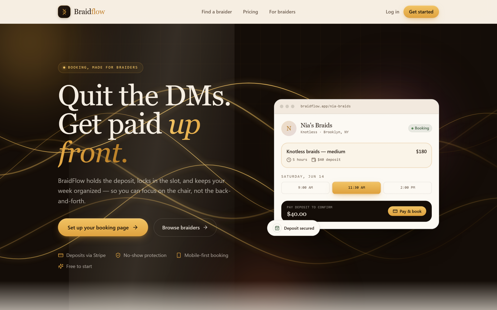
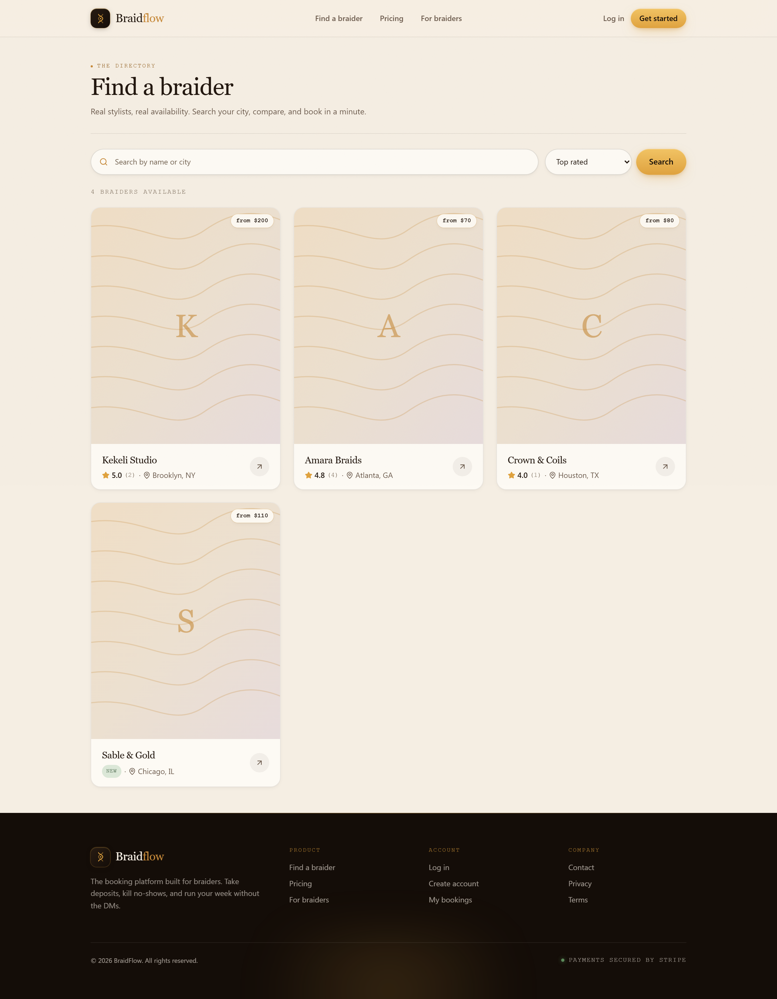
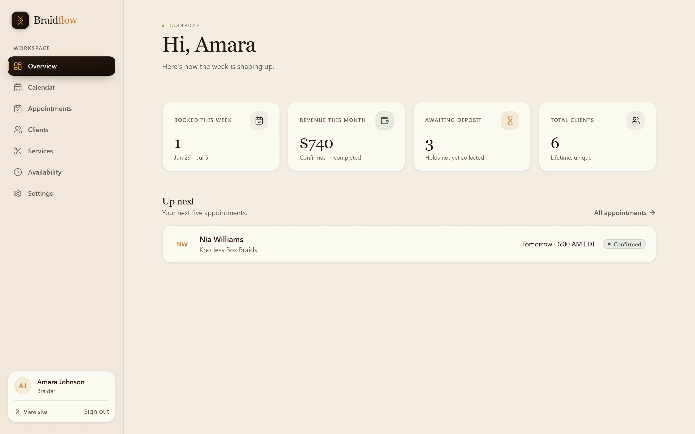
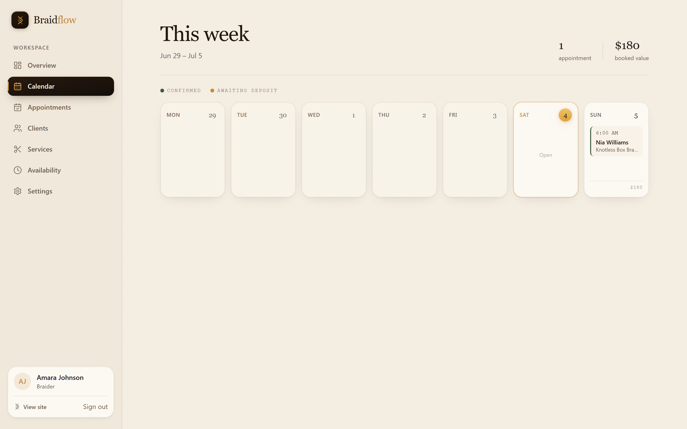
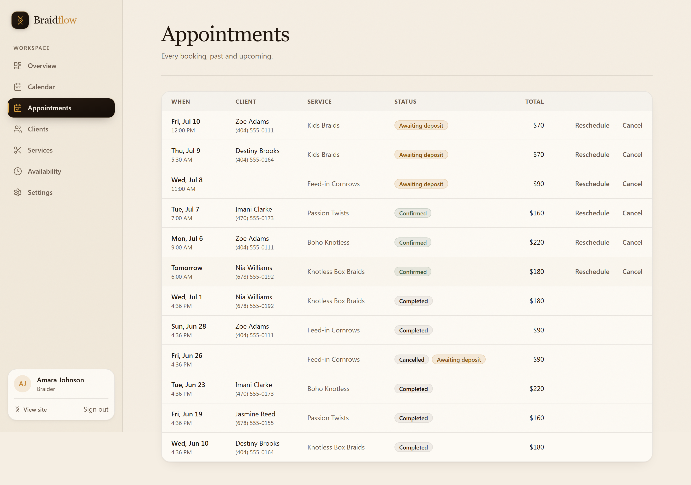

# BraidFlow — a booking-and-deposit platform built for hair braiders

**Role:** Solo — product design + full-stack engineering
**Timeline:** Design, build, and ship (concept → live demo)
**Platform:** Responsive web app (mobile-first, 390px → desktop)
**Live demo:** [braidflow.vercel.app](https://braidflow.vercel.app) · sign in as `amara@braidflow.app` (any password) to enter the braider dashboard
**In one line:** Quit the DMs. Get paid up front — a shareable booking page that collects a Stripe deposit, locks the slot, and runs the braider's whole week from one dashboard.


*The hero states the whole pitch: hold the deposit, lock the slot, kill the back-and-forth. The card on the right is the actual booking UI, not a stock illustration.*

## Overview

I designed and built BraidFlow end to end — the brand, the interface, the design system, the server actions, the payment flow, and the data layer. It is one product with two audiences: a client picks a style and pays a deposit in about ninety seconds, and a braider sets up a booking page in about fifteen minutes, then works the week from a single dashboard.

The whole thing is deliberately concrete. Deposits are money, no-shows are lost hours, a slot is a physical chair. Every screen is built by someone who understood that a braider's appointment isn't a thirty-minute haircut — it's a four-to-eight hour commitment that's expensive to lose.

## Problem

Braiders run their business inside Instagram and TikTok DMs. Every booking is a negotiation: What's your price for knotless? How long is my hair? Do you take a deposit? What day? The thread scrolls, the details get lost, and nothing is actually confirmed until money changes hands — which it usually doesn't until the client is already in the chair.

That gap is where the damage happens. A no-show or a last-minute cancel doesn't cost thirty minutes; it burns a half-day block that can't be refilled on short notice. The braider absorbs the loss.

The obvious answer — Square, Acuity, Calendly — doesn't fit. Those tools model short appointments back to back and treat a deposit as a paid add-on you configure, not the default. A braider who tries to bend them into shape ends up fighting the product. The core financial move of the business — taking money before the chair is held — is the one thing generic scheduling makes hardest.

## Goals

- Make the deposit the default, not a setting buried three menus deep.
- Get a client from a link to a confirmed, paid slot in about ninety seconds, with no forced account.
- Give the braider one dashboard for the week: what's booked, what's owed, who's coming, what's still just a hold.
- Model the real shape of the work — long appointments, whole days blocked for kids' events or vacation, per-service deposit amounts.
- Ship something that deploys and runs with zero backend configuration, so the live demo is the real product.

## Research

I didn't fake a user study. I grounded the product in two things I could actually verify: the domain, and the competition.

The domain reasoning came from how braiding is priced and scheduled — long sessions, deposit-gated, style-dependent, seasonally spiky. That shapes everything downstream: why a "day-block" for a kid's recital matters more than a fifteen-minute buffer, why a per-service deposit beats a flat one, why "booked this week" has to mean the braider's week.

The competitive teardown was concrete. I mapped Square, Acuity, and Calendly against the braider's actual job and found the same three gaps every time: appointments modeled as short slots, deposits treated as optional friction, and no clean way to take a whole day off the board. BraidFlow is built on the inverse of those three assumptions. Any "result" in this case study is an engineering outcome — I have not invented adoption numbers or no-show reductions, because there aren't real customers to measure.


*The directory doubles as a marketplace: search by name or city, sort by rating, and every card carries a real star average and a "from" price so a client can compare before they click in.*

## Design Decisions

**The atelier aesthetic.** Booking tools tend to look like tax software. I went the other way — warm cream and paper backgrounds, onyx ink for text, one gold accent, and an editorial serif for display headings. The braider's own work is craft; the tool that represents it online should read like quiet luxury, not neon SaaS. The tradeoff is restraint: a single accent color means hierarchy has to come from type scale, spacing, and a soft gold corner-glow on hover rather than a rainbow of button states. That restraint is the point.

**Deposit-first booking.** The booking flow refuses to treat the deposit as optional. A client picks a style, picks a slot, and pays before the chair is held — the "Pay & book" button is the primary action, and the deposit amount is shown on the card the entire time. Nothing about the interface implies you can reserve without paying, because in the braider's real world you can't.

**Guest checkout.** Requiring an account before a first booking is exactly the friction braiders are trying to escape. So the client path allows guest checkout — no signup — and each per-booking page self-authorizes with either an owner session or a guest token. Fewer clients drop; the braider still gets a clean record.

**The activation checklist.** A booking page is useless until it has a service, hours, and a way to get paid. Rather than let a new braider wander, the dashboard shows a guided checklist — add a service, set availability, connect Stripe — so the path to a live page is a sequence, not a scavenger hunt.

**Timezone-correct counts.** "Booked this week" and "revenue this month" are computed in the braider's own zone, not the server's UTC. This is invisible when it's right and infuriating when it's wrong — a Saturday-night booking should not land in next week's count because a datacenter rolled past midnight first.

## Architecture

BraidFlow is a Next.js 14 App Router application organized into route groups — `(marketing)`, `(auth)`, `(braider)`, `(client)` — so the public site, the auth screens, the dashboard, and the client booking flow each have their own layout and boundary while sharing one design system.

Reads happen in server components, close to the data. Mutations are **server actions** validated with **Zod** at the boundary, so nothing untrusted reaches the store. Route protection runs on the **Edge**: `middleware.ts` verifies a signed httpOnly session cookie and gates `/dashboard` and the `/bookings` list without a single backend round-trip.

The payment lifecycle is a small state machine, and the **Stripe webhook is its only source of truth**. The client never flips a booking to confirmed — the deposit's `payment_intent.succeeded` event does.

```
  create hold                deposit paid (webhook)          service done
      │                            │                              │
      ▼                            ▼                              ▼
 pending_payment ───────────► confirmed ─────────────────────► completed
      │                            │
      │ TTL elapses / PI dead      │ refund / no-show
      ▼                            ▼
  cancelled ◄──────────────────────
   (Vercel Cron releases the slot)
```

Two **Vercel Cron** endpoints keep that machine honest without human intervention: one sends appointment reminders, the other releases abandoned holds so a slot never sits dead because someone opened checkout and walked away.

The last architectural decision is the one that makes the demo possible. The entire data layer sits behind a `db()` / `dbAdmin()` interface — an in-memory store fronted by a **PostgREST-style query builder** with a deterministic seed. Feature code writes `db().from('bookings').select(...).eq(...)` and doesn't know or care that the rows live in memory. Swap the implementation and the same feature code runs against real Postgres. That single seam is why BraidFlow deploys with no database to provision and no env vars required.

## Development

I built the data abstraction first, because everything else leans on it. The query builder emulates exactly the subset of the PostgREST API the app actually uses — chainable filters, embedded joins, `single`/`maybeSingle`, count/head, and the insert/update/delete/upsert mutations — resolving to the familiar `{ data, error, count }` shape. Crucially, it reproduces the behaviors the app depends on, including unique-constraint conflicts that surface as Postgres error code `23505`. That error isn't cosmetic; it drives slug minting, one-review-per-booking, and webhook idempotency.

From there I worked outward: personas and the signed-cookie auth, then the braider dashboard, then the client booking flow, then Stripe Connect and the webhook, then the cron jobs. TypeScript ran in strict mode the whole way, so the contracts between server actions, the store, and the UI stayed honest.


*The overview answers the four questions a braider actually asks on a Monday: what's booked this week, what came in this month, what's still just a hold, and how many clients total. "Up next" surfaces the next five.*

## Challenges

I'll name four that were genuinely hard, not decorative.

1. **Timezone-correct math across zones.** A server in UTC and a braider in Los Angeles disagree about what "this week" is for several hours every night. Getting weekly counts and monthly revenue to match the braider's local calendar is subtle, and easy to get wrong in a way nobody notices until a number looks off.
2. **Zero-config deploy.** I wanted the live demo to *be* the product, which meant it had to run with no database, no auth provider, and no secrets — while keeping the exact code paths a real backend would use.
3. **Deposit / no-show flow.** Stripe delivers events at-least-once and can replay them. A confirmation must not be sent twice, and a late event must never resurrect a booking that already expired.
4. **Edge-safe auth.** The session has to verify identically in Edge middleware and in Node server actions. Node's `crypto` module isn't available at the Edge, so a naive implementation forks into two code paths that can drift.

## Solutions

**Timezone math.** I compute week and month boundaries with `TZDate.tz(tz)` from `@date-fns/tz`, anchoring `startOfWeek`/`endOfMonth` in the braider's stored IANA zone before any counting happens. The zone itself is validated at runtime against `Intl.DateTimeFormat`, and the dropdown is curated US-first with common diaspora zones (Lagos, Nairobi, London) for braiders working across borders.

**Zero-config deploy.** The `db()` seam solved this. Because feature code only knows the query interface, the in-memory store with a deterministic seed is a drop-in — the app boots with realistic sample data and no external service. The same interface accepts a real Postgres/Supabase client with no changes to feature code. Zero configuration for the demo, one swap for production.

**Deposit / no-show flow.** The webhook records each Stripe event id *first*; a duplicate delivery collides on `23505` and is skipped before any work runs. The promotion to `confirmed` is a guarded, atomic update — `update({ status: 'confirmed' }).eq('id', id).eq('status', 'pending_payment')` — so only the first transition returns a row, which means the confirmation email fires exactly once and a replayed event can't revive a cancelled hold. The expiry cron mirrors that care: it cancels the deposit PaymentIntent *before* releasing a slot, so if the client actually paid, Stripe rejects the cancel and the booking is left for the webhook to confirm. Money-taken-slot-released can't happen.

**Edge-safe auth.** The session token is a base64url JSON payload signed with HMAC-SHA256, built entirely on the Web Crypto API and `btoa`/`atob` — no Node-only modules. The exact same `readSessionToken` runs in middleware and in server actions, with a constant-time comparison so signature checks can't be timed. One implementation, two runtimes, no drift.

## Performance

Server components and route prefetch do most of the heavy lifting — the client ships markup, not a data-fetching waterfall. First-load JS sits at roughly **149 kB shared baseline**. Post-deploy QA on the live Vercel URL came back clean across landing, auth, and every dashboard route: **zero console errors, zero page errors, zero hydration warnings, and no failed HTTP requests.**


*The calendar renders the braider's week as seven cards with a running appointment count and booked value, color-coded for confirmed vs. awaiting-deposit — all bounded to the braider's own timezone.*

## Accessibility

Accessibility was built in, not bolted on. Semantic landmarks structure every page. Inputs are labeled. Menus carry `aria-*` state and dismiss from the keyboard. Focus-visible styling is deliberate and consistent, so keyboard users always know where they are. Anyone who prefers reduced motion gets a static fallback instead of the spring animations. None of this is glamorous, and that's the point — it's the baseline a commercial product owes its users.

## Animations

Motion is spring-eased and quiet. Content reveals on scroll via a small `Reveal` primitive backed by `IntersectionObserver`, so sections settle into place as you move down the page rather than all at once. Cards lift with a soft gold corner-glow on hover. Every one of these respects `prefers-reduced-motion`. The goal was atelier, not arcade — motion that flatters the craft without demanding attention.

## Responsive Design

The app is mobile-first because the client booking flow lives on a phone — it's a bio-link tap away. I verified the full range from **390px to desktop** with no horizontal overflow. The dashboard collapses its sidebar into a keyboard-dismissible menu, tables reflow, and the booking card stays legible at the narrowest width.


*The hero holds up at 390px — the serif display scales, the primary "Set up your booking page" action stays thumb-reachable, and the trust row wraps cleanly.*

## Results

I'm honest about what "results" means here: this is a portfolio-grade product with realistic sample data, not a business with paying customers. So the results are engineering outcomes, and they're real.

- Production build is clean; all routes compile; TypeScript strict passes.
- Live QA: 0 console errors, 0 page errors, 0 hydration warnings, no failed requests.
- Fully responsive, 390px → desktop, no overflow.
- ~149 kB shared first-load JS.
- Deploys on Vercel with zero required environment variables.


*Every booking in one table, past and upcoming, with status badges (awaiting deposit, confirmed, completed, cancelled) and per-appointment totals — reschedule and cancel are one click from the row.*

## Lessons Learned

The abstraction that made the demo trivial was the same one that made the product serious. Deciding early that feature code would only ever see `db()` forced clean boundaries everywhere else — and it's why "run it with no backend" and "run it on real Postgres" are the same codebase.

I also relearned that the source of truth has to be singular. The instant I let the client and the webhook both claim authority over booking state, the edge cases multiplied. Naming Stripe the only thing that confirms a payment collapsed a dozen race conditions into one guarded update.

And restraint reads as quality. One accent color and one serif did more for the product's credibility than any amount of visual noise would have.

## Tech Stack

**Framework & language**
- Next.js 14 (App Router, React Server Components, Server Actions), React 18
- TypeScript (strict), Tailwind CSS, custom design system

**Payments & scheduling**
- Stripe — Connect (payouts), Elements (checkout), webhooks
- date-fns + @date-fns/tz — timezone-correct scheduling
- Zod — input validation

**Platform & infrastructure**
- Edge Middleware (signed-cookie auth via Web Crypto HMAC)
- Vercel Cron — reminders + expiry of unpaid holds
- Resend — transactional email (no-ops cleanly with no key)
- Sentry — error + performance monitoring; security headers; audit logging
- Vitest — unit/integration tests
- Self-contained data layer — in-memory store behind a PostgREST-style query builder with a deterministic seed, swappable for real Postgres via one interface
- Deployed on Vercel (zero-config)

## Future Improvements

- Two-way calendar sync (Google/Apple) so a braider's personal calendar and BraidFlow never double-book.
- Deposit-forfeit and rebooking rules configurable per braider, tied to the cancellation window.
- SMS reminders alongside email, since braiders and clients live in text threads.
- A deposit-to-balance ledger view so a braider can see, per client, what's paid and what's owed in person.
- Waitlist auto-fill: when a hold expires, offer the freed slot to the next client in line.

---

*Designed and built by **Mohammed El Kabouri** ([@elkamohammad1988](https://github.com/elkamohammad1988)). BraidFlow is proprietary — all rights reserved; source-available for evaluation and portfolio review only. Available for acquisition or licensing.*
